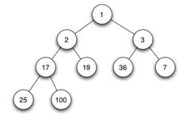

# 堆（Heap）


## 0X00 什么是堆——感性认识


堆是一种二叉树


为了充分认识`堆是什么`我拿最小堆举个例子，`最小堆就是满足父节点（除叶子节点）比两个子节点都要小的二叉树`


如下面这个图：





1 小于 2 和 3；2 小于 17 和 19


## 0X01 堆的性质


**我们通常用 array 实现堆，所以 array 的索引满足一些性质，而且我们从 1 开始计数**


这些性质对于解题来说至关重要：


+ 节点与子节点索引之间的关系

  

$$leftChild = parent * 2$$

$$rightChild = leftChild + 1 = 2 * parent + 1$$


+ 最后一个节点的索引


$$last = array.length$$


## 0X02 堆的实现


用 python 实现：


### 最大堆


```python
class MaxHeap:
    def __init__(self):
        self.heap = [None]
        self.length = 0

    def insert(self, e):
        """
        将一个元素插入堆中
        1. 添加元素
		2. 长度+1
        3. 冒泡
        """
        self.heap += [e]
        self.length += 1
        self.bubble_up(self.length)

    def bubble_up(self, idx):
        """
        将最后一个元素不断与自己的父亲比较直到满足堆的性质
        1. 从底向上冒泡
            1. 如果父元素比自己大等，停止
            2. 如果父元素的索引等于 0，停止
        """
        parent = idx // 2
        while parent > 0 and self.heap[parent]  < self.heap[idx]:
            self.heap[idx], self.heap[parent] = self.heap[parent], self.heap[idx]
            idx, parent = parent, parent // 2

    def delete(self):
        """
        删除堆顶的一个元素
        1. 判断空
            返回 None
        2. 判断不空
            1. 将要返回值设置为堆顶的元素
            2. 将堆顶的元素与最后一个元素交换
            3. 把第一个元素下沉
        """
        if self.length < 1:
            return None
        minm = self.heap[1]
        self.heap[1],  self.heap[self.length] = self.heap[self.length], self.heap[1]
        self.length -= 1
        self.heap.pop(-1)
        self.bubble_down(1)
        return minm

    def bubble_down(self, idx):
        """
       	将指定索引元素下沉
       	1. 不断与子节点比较（进入循环）
       		1. 如果子节点的索引超出长度则退出
       		2. 找到子节点中最大的值的索引
       		3. 父节点与最大的子节点比较
       			1. 如果比它大等就退出
       			2. 比它小就与节点交换，然后进入下一轮循环
        """
        parent = idx
        child = 2 * idx
        while child <= self.length:
            if child < self.length and self.heap[child] < self.heap[child+1]:
                child += 1
            if self.heap[parent] >= self.heap[child]:
                break
            else:
                self.heap[parent], self.heap[child] = self.heap[child], self.heap[parent]
            parent = child
            child *= 2
```


### 最小堆


```python
class MinHeap:
    def __init__(self):
        self.heap = [None]
        self.length = 0

    def insert(self, e):
        """
        将一个元素插入堆中
        1. 添加元素
		2. 长度+1
        3. 冒泡
        """
        self.length += 1
        self.heap += [e]
        self.bubble_up(self.length)

    def bubble_up(self, idx):
        """
        将最后一个元素不断与自己的父亲比较直到满足堆的性质
        1. 从底向上冒泡
            1. 如果父元素比自己小等，停止
            2. 如果父元素的索引等于 0，停止
        """
        parent = idx // 2
        while parent > 0 and self.heap[parent] > self.heap[idx]:
            self.heap[idx], self.heap[parent] = self.heap[parent], self.heap[idx]
            idx, parent = parent, parent // 2

    def delete(self):
        """
        删除堆顶的一个元素
        1. 判断空
            返回 None
        2. 判断不空
            1. 将要返回值设置为堆顶的元素
            2. 将堆顶的元素与最后一个元素交换
            3. 把第一个元素下沉
        """
        if self.length < 1:
            return None
        minm = self.heap[1]
        self.heap[1],  self.heap[self.length] = self.heap[self.length], self.heap[1]
        self.length -= 1
        self.heap.pop(-1)
        self.bubble_down(1)
        return minm

    def bubble_down(self, idx):
        """
       	将指定索引的值下沉
       	1. 不断与子节点比较（进入循环）
       		1. 如果子节点的索引超出长度则退出
       		2. 找到子节点中最小的值的索引
       		3. 父节点与最大的子节点比较
       			1. 如果比它小等就退出
       			2. 比它大就与节点交换，然后进入下一轮循环
        """
        parent = idx
        child = 2 * idx
        while child <= self.length:
            if child < self.length and self.heap[child] > self.heap[child+1]:
                child += 1
            if self.heap[parent] <= self.heap[child]:
                break
            else:
                self.heap[parent], self.heap[child] = self.heap[child], self.heap[parent]
            parent = child
            child *= 2

```


