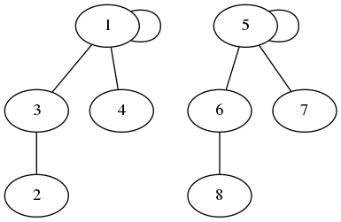
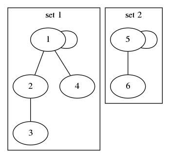
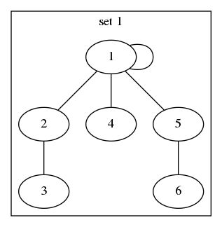
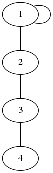
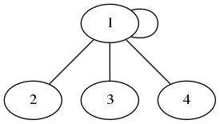
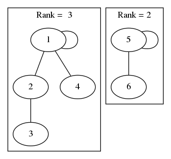

#  并查集（Union–find）


## 0X00 什么是并查集——感性认识


并查集是一种树形的数据结构，他有两个典型的操作：


+ **Union** 将两个子集合并成同一个集合 
+ **Find** 确定元素属于哪一个子集。它可以被用来确定两个元素是否属于同一子集


**为了有一个感性认识，我分别为上述两个操作各举一个例子**，注意！以下圆圈的内容不是值，而是用来标识这个节点的


通常并查集用数组实现所以，这个值通常是数组的索引


### Find


**Find 本质就是查找子节点的根节点**





其中 Find(2) = 1，Find(8) = 5


**由于 Find(2) 不等于 Find(8) 所以 2 和 8 不在一个集合内部**


### Union


**Union 的本质是合并两个根节点**



 

现在Union(3, 6) 其实就是将一个 set 的根节点放在另一个根节点的下面：





**至于为什么这么合并，为什么不把 1 接在 5 后面，会在代码中说明**


## 0X01 分析并查集


现在我们来讨论这**两个操作需要的时间**，也是感性的讨论，绕过数学证明


### Find


由于我们在查找过程中有「**压缩路径**」这个操作，所以我们平均查找时间是 **O(1)**


什么是压缩路径？还是来感性认识！用图说话：





现在开始 Find(4) 由于 4, 3 的根节点都是 1 所以在 Find 的过程中，会将 4, 3 的父节点直接指向根节点，就变成：





所以下次再 Find(4) 的时候就会直接指向 1，而不用向之前那样从底向上寻找了


### Union


由于 Union(3, 6) 其实就是根节点的合并，所以只需将其中一个 Rank 低的根节点指向另外一个根节点就可以了


什么是 Rank ?其实就是**节点的子节点的最大高度 + 1**





Union 平均时间也是 **O(1)**，Union 的主要时间消耗在 Find 根节点，由于 Find 是 O(1) 所以 Union 是 O(1)


对于并查集两个操作的时间的解释可以参考：[wiki 并查集](https://zh.wikipedia.org/wiki/并查集)


## 0X02 实现并查集


使用数组实现并查集，主要实现 Find 和 Union 两个操作：


```python
class UnionFindSet:
    def __init__(self, n):
        """
        初始化并查集，还没有边的存在
        1. 每个节点都是它的父节点
        2. 每个节点的 rank 都是 1
        """
        self.parents = [i for i in range(n + 1)]
        self.ranks = [1 for i in range(n + 1)]
    
    def find(self, x):
        """
        查找自己根节点的同时并进行路径压缩
        递归查找，并将经过的路径设置为最后的根节点
        """
        if self.parents[x] != x:
            self.parents[x] = self.find(self.parents[x])
        return self.parents[x]
    
    def union(self, x, y):
        """
        合并两个树
        1. 如果两个树的根节点一样则返回
        2. 如果两个树的根节点不一样开始合并
        	1.  将 rank 小的合并到 rank 大的上面
        	2. 两个 rank 相等，则选择一个合并到另一个上面，另一个的 rank++
        """
        px, py = self.find(x), self.find(y)
        if px == py: return False
        
        if self.ranks[px] < self.ranks[py]:
            self.parents[px] = py
        elif self.ranks[px] > self.ranks[py]:
            self.parents[py] = px
        else:        
            self.parents[px] = py
            self.ranks[py] += 1
        
        return True
```


## 0X03 相关题解


在当前目录下

